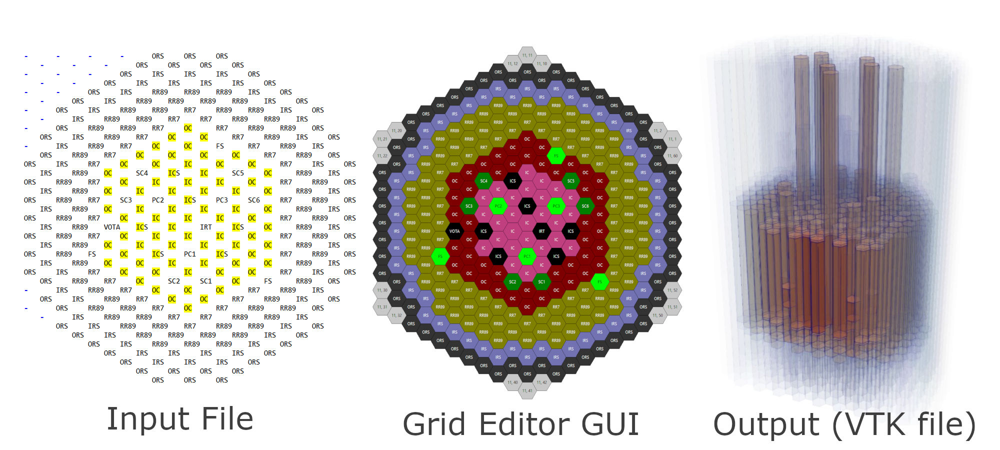
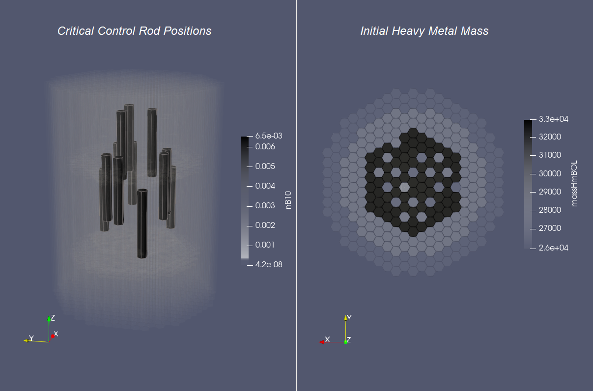

***************
ARMI FFTF Model
***************
This repository contains a pin-detailed full core description of the `Fast Flux
Test Facility <https://en.wikipedia.org/wiki/Fast_Flux_Test_Facility>`_ (FFTF)
reactor in the form of input files for the open-source nuclear reactor analysis
framework, `ARMI <https://terrapower.github.io/armi>`_.  

The FFTF was a 400 MWt liquid-metal cooled fast-neutron reactor in Washington state
that achieved criticality in 1980 and operated from 1982 to 1992. During
startup, tests were performed determining the critical control rod positions
and measuring control rod worths, excess reactivity, shutdown margin, and the
isothermal reactivity coefficient.

A full description of the core and benchmark results was published by Bess, et.
al [#bess2010]_. We have translated the information in that public document
into ARMI input files. You can use them to validate your nuclear analysis codes
or to perform any other analysis based on FFTF. 

.. [#bess2010] John Bess, et. al, "Evaluation of the Initial Isothermal Physics Measurements at the 
   Fast Flux Test Facility, a Prototypic Liquid Metal Fast Breeder Reactor", INL/EXT-09-16524 
   (March 2010) https://digital.library.unt.edu/ark:/67531/metadc1013078/

The input files contain a pin-detailed description of fuel and absorber assemblies and
homogenized descriptions of others. ARMI automatically homogenizes the pin-detailed
parts and agreement with the published homogenized compositions has been verified.

The control rods are in their defined critical positions (but can be moved with the
ARMI framework). 

TerraPower uses this model plus a set of physics modules to perform weekly
Continuous Integration testing of ARMI and the physics tools using MC2-3 for
cross sections and DIF3D/VARIANT for global flux. VARIANT P3/P3 mode or similar
is recommended for reaching accurate results.

We hope that by providing these ARMI inputs and the digital
FFTF-at-your-fingertips in a software-accessible form, the limited labor
dedicated to nuclear analysis can focus more efficiently on pushing the
envelope in nuclear technology development and deployment.

Interacting with this model
===========================
To use these inputs, first `install ARMI
<https://terrapower.github.io/armi/installation.html>`_, and also go through
the optional wxPython and Paraview sections.

View the core map
-----------------
For a quick demo, run::

    (armi-venv) $ python -m armi grids FFTF-blueprints.yaml

to pull up the graphical GUI editor for the core map. 

Run a dummy case and view the output database
---------------------------------------------
Now run a quick ARMI main loop (even though no physics plugins are active) to get a 
output database::

    (armi-venv) $ python -m armi run FFTF.yaml

This will print lots of text and produce a `binary output file
<https://terrapower.github.io/armi/user/outputs/database.html>`_ called
``FFTF.h5``.  Convert this to a VTK file for visualization with::

    (armi-venv) $ python -m armi vis-file FFTF.h5

Now open up your Paraview or VisIT program to view the model in 3D. Check out some of the
number density parameters to see the core loading and control rod positions. 

Explore the data model
----------------------
Then, we recommend going through ARMI's `Hands-on at the ARMI Terminal
<https://terrapower.github.io/armi/tutorials/data_model.html>`_ tutorial but
swap out the input files used there for these FFTF inputs to get started.

More resources
--------------
You can learn more about the ARMI input format `in this input tutorial
<https://terrapower.github.io/armi/tutorials/walkthrough_inputs.html>`_

Doing real analysis
-------------------
To run physics calculations, you will need some ARMI plugins that bring
in physics capabilities. The `DRAGON plugin
<https://github.com/terrapower/dragon-armi-plugin>`_ can compute microscopic
cross sections for this model in ISOTXS format. More physics capabilities
will become available as more people build ARMI plugins to other codes.

Credits
=======
* Mohamed Elsawi initially created the FFTF input deck
* Jacob Hader moved the CRs to the critical position and made several other enhancements

